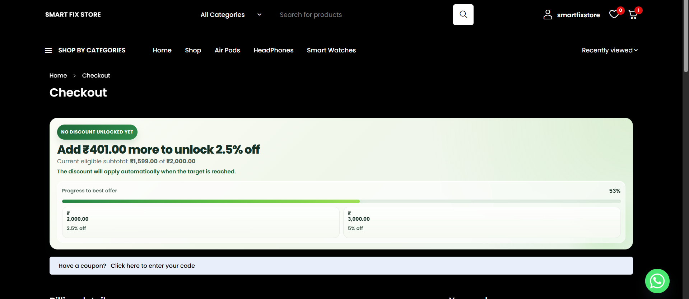

# WC Cart Discount Progress



WooCommerce plugin that:

- Applies `2.5%` discount when cart subtotal reaches `2000`
- Applies `5%` discount when cart subtotal reaches `3000`
- Shows a progress banner at the top of the checkout page
- Updates the banner automatically as checkout totals refresh

## Change discount values

Open [wc-cart-discount.php](C:/Users/Lenovo/Downloads/wc-cart-discount/wc-cart-discount.php) and update the `$discount_rules` array:

```php
private $discount_rules = array(
	2000 => 2.5,
	3000 => 5.0,
);
```

Example:

```php
private $discount_rules = array(
	1500 => 3.0,
	2500 => 6.0,
	4000 => 10.0,
);
```

## Install

1. Place this plugin folder inside `wp-content/plugins/`
2. Activate it from WordPress admin
3. Make sure WooCommerce is active

## Notes

- Discount is calculated on cart product subtotal
- Shipping is not used for discount threshold calculation
- Banner is shown on the classic WooCommerce checkout flow
